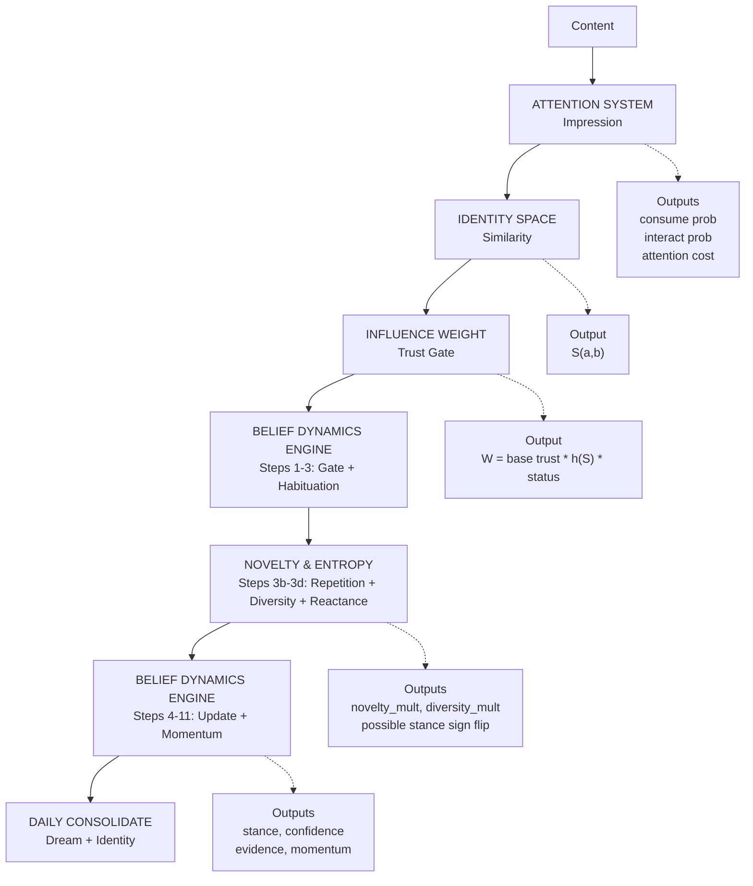
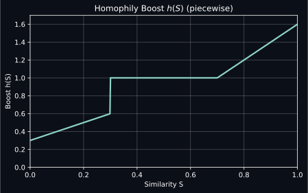
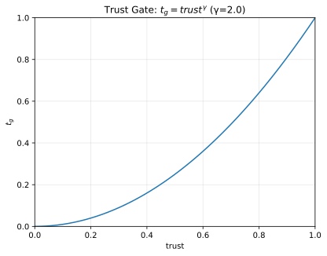
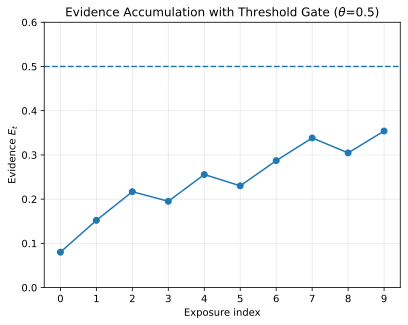
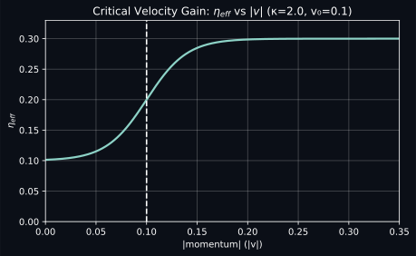

# Influence Mathematics

## Formal Specification of Belief Dynamics, Identity Similarity, and Population Mechanics

This document provides the complete mathematical specification for gsocialsim's influence pipeline. Every formula here maps directly to implemented C++ code.

---

## Table of Contents

1. [System Overview: The Influence Pipeline](#1-system-overview-the-influence-pipeline)
2. [Dimensional Identity Similarity](#2-dimensional-identity-similarity)
3. [Homophily-Based Influence Weight](#3-homophily-based-influence-weight)
4. [Attention and Impression Evaluation](#4-attention-and-impression-evaluation)
5. [Belief Dynamics Engine (11-Step Pipeline)](#5-belief-dynamics-engine-11-step-pipeline)
6. [Content Novelty and Message Entropy](#6-content-novelty-and-message-entropy)
7. [Legacy Belief Update Engine](#7-legacy-belief-update-engine)
8. [Identity Consolidation](#8-identity-consolidation)
9. [Dream Consolidation](#9-dream-consolidation)
10. [Population-Level Dynamics](#10-population-level-dynamics)
11. [Cross-Border Factors](#11-cross-border-factors)
12. [Media Diet and Saturation](#12-media-diet-and-saturation)
13. [Actor Capabilities](#13-actor-capabilities)
14. [Parameter Reference](#14-parameter-reference)

---

## 1. System Overview: The Influence Pipeline

Every piece of content flows through a multi-stage pipeline before it can change an agent's beliefs. The pipeline is designed so that belief change is rare, attributable, and causal.



---

## 2. Dimensional Identity Similarity

**Source**: `identity_space.h`, `identity_space.cpp`

### 2.1 Design Principle

Every identity category is embedded onto a continuous 1–5 dimensional coordinate space. Similarity is computed as a weighted sum of exponential decay functions over Euclidean distance. One codepath for all dimensions.

### 2.2 Coordinate Resolution

Each agent's demographic labels are mapped to coordinate vectors:

```text
resolve(AgentDemographics) -> AgentIdentityCoords
-----------------------------------------------
For each dimension d in config:
    label = agent.demographic_field[d.name]
    position = d.positions[label]
    if d.y_source is set:
        position.y = agent.field[d.y_source]   (e.g., religiosity)
    coords[d.name] = position
```

**Age normalization** (maps 18–90 to 0–1):

```math
p_{\text{age}} = \frac{\text{age} - 18}{72}
```

**Political ideology** (5D from scalar fallback):

```math
\vec{p}_{\text{pol}} =
\begin{pmatrix}
x \\
-0.8x \\
0 \\
0.5x \\
0.4x
\end{pmatrix}
\quad \text{where } x = \text{political\_ideology} \in [-1, +1]
```

Or from full `PoliticalIdentity`:

```math
\vec{p}_{\text{pol}} =
\begin{pmatrix}
\text{economic\_left\_right} \\
\text{social\_progressive\_traditional} \\
\text{libertarian\_authoritarian} \\
\text{cosmopolitan\_nationalist} \\
\text{secular\_religious}
\end{pmatrix}
```

### 2.3 Per-Dimension Similarity

For dimension d with decay rate τ_d:

```math
s_d(a, b) = \exp\!\left(-\frac{\|\vec{p}_d^a - \vec{p}_d^b\|}{\tau_d}\right)
```

where ‖·‖ is Euclidean distance.

### 2.4 Overall Similarity

Weighted sum with auto-normalization:

```math
S(a, b) = \frac{\sum_{d} w_d \cdot s_d(a, b)}{\sum_{d} w_d}
```

### 2.5 Dimension Coordinate Maps

**Religion** (2D: tradition family x devotional intensity)

```text
Devotion
(y) 1.0 |
         |       * evangelical (0.00, 0.85)
    0.8  |   * mormon (0.10, 0.80)
         | * sikh (-0.60, 0.70)     * muslim (0.40, 0.70)
    0.6  |* jain    * orthodox  * catholic         * jewish
         |  (-0.75)  (-0.20)     (-0.15)            (0.30)
         |    * hindu    * protestant
    0.4  |    (-0.70)     (-0.05)
         |
    0.2  |                                    * secular (0.80)
         |                                  * agnostic (0.85)
    0.0  |                                * atheist (0.90)
         +----+----+----+----+----+----+----+----+----+---> x
        -1.0 -0.8 -0.6 -0.4 -0.2  0.0  0.2  0.4  0.6  1.0
               Dharmic <---  Tradition Family  ---> Non-theistic
```

Devotion (y-axis) is overridden per-agent from the `religiosity` field.

**Race/Ethnicity (US)** (2D: social boundary x cultural practice)

```text
Cultural
Practice
(y) 0.2  |
         |
    0.0  | * white (0.00, 0.00)
         |     * multiracial (-0.20, -0.20)
   -0.2  |           * other (0.00, -0.30)
         |
   -0.4  |   * hispanic (-0.30, -0.40)
         |
   -0.6  | * black (-0.80, -0.60)
         |                              * asian (0.20, -0.70)
   -0.8  |
         +----+----+----+----+----+----+----+---> x
        -1.0 -0.8 -0.6 -0.4 -0.2  0.0  0.2
                   Social Boundary Distance
```

**Race/Ethnicity (India)** (maps to caste/community)

```text
(y) 0.6  |                     * tribal (-0.60, 0.50)
         |
    0.4  |
         |            * dalit (-0.70, 0.20)
    0.2  |      * obc (-0.30, 0.10)
         |
    0.0  |                   * upper_caste_hindu (0.00, 0.00)
         |
   -0.2  |
         |                         * sikh (0.20, -0.30)
   -0.4  |
         |                       * christian (0.15, -0.50)
   -0.6  |
         |
   -0.8  |                    * muslim (0.10, -0.80)
         +----+----+----+----+----+----+---> x
        -0.8 -0.6 -0.4 -0.2  0.0  0.2  0.4
```

**1D Dimensions** (common across countries)

```text
Geography:   urban_core -------- suburban --------- small_town ------- rural
               0.00               0.35                0.65             1.00

Education:   high_school ------- some_college ------ bachelors ------- graduate
               0.00               0.35                0.70             1.00

Gender:      male -------------- non_binary --------- female
               0.00               0.50                 1.00

Income:      low --------------- middle ------------- upper_middle ---- high
               0.00               0.35                 0.65            1.00

Age:         18 -------------------------------------------- 90
             0.00                                            1.00
                               (age - 18) / 72
```

### 2.6 Default Weights and Decay Rates

| Dimension          | Dims | Weight | Decay | Notes                             |
| ------------------ | ---: | -----: | ----: | --------------------------------- |
| political_ideology |    5 |     25 |  0.30 | Strongest factor                  |
| race_ethnicity     |    2 |     20 |  0.30 | Country-configurable              |
| religion           |    2 |     15 |  0.40 | y overridden by religiosity       |
| geography          |    1 |     15 |  0.50 | Universal urban-rural             |
| age                |    1 |     10 |  0.28 | ~20yr half-life normalized        |
| education          |    1 |      8 |  0.50 | Credential boundary               |
| gender             |    1 |      4 |  0.60 | Weakest general factor            |
| income             |    1 |      3 |  0.50 | Partly captured elsewhere         |
| language           |    2 |      0 |  0.40 | Set > 0 in multilingual countries |
| class_culture      |    1 |      0 |  0.50 | Optional                          |

Weights auto-normalize:

```math
w_d' = \frac{w_d}{\sum_d w_d}
```

### 2.7 Distance Spot-Checks

| Pair                          | Distance | Similarity (decay=0.40) |
| ----------------------------- | -------: | ----------------------: |
| Protestant -- Catholic        |     0.11 |                    0.76 |
| Catholic -- Hindu             |     0.55 |                    0.25 |
| Devout evangelical -- Atheist |     1.24 |                    0.04 |
| Atheist -- Agnostic           |     0.07 |                    0.84 |
| Urban -- Suburban             |     0.35 |       0.50 (decay=0.50) |
| Urban -- Rural                |     1.00 |       0.14 (decay=0.50) |

---

## 3. Homophily-Based Influence Weight

**Source**: `agent_demographics.cpp`

The influence weight from source agent to target agent combines demographic similarity with trust and status.

### 3.1 Similarity Computation

```math
S = \mathtt{IdentitySpace::compute\_similarity}(a, b)
```

### 3.2 Homophily Boost



```math
h(S) =
\begin{cases}
0.3 + S & \text{if } S < 0.3 \\
1.0 & \text{if } 0.3 \le S \le 0.7 \\
1.0 + 2(S - 0.7) & \text{if } S > 0.7
\end{cases}
```

### 3.3 Status Boost

```math
B_{\text{status}} = 1.0
+ 0.2 \cdot \mathbb{1}[\text{verified}]
+ 0.3 \cdot \mathbb{1}[\text{influencer}]
```

### 3.4 Final Influence Weight

```math
W = \text{base\_trust} \cdot h(S) \cdot B_{\text{status}}
```

---

## 4. Attention and Impression Evaluation

**Source**: `agent.cpp` (AttentionSystem::evaluate)

### 4.1 Intake Modes

| Mode       | Consume Mult | Interact Mult | Cost Mult | Description     |
| ---------- | -----------: | ------------: | --------: | --------------- |
| SCROLL     |         0.60 |          0.70 |      1.00 | Passive feed    |
| SEEK       |         1.00 |          0.90 |      1.25 | Active search   |
| PHYSICAL   |         1.20 |          0.75 |      1.50 | In-person       |
| DEEP_FOCUS |         1.40 |          0.60 |      3.00 | Rare, expensive |

### 4.2 Media Type Base Rates

| Media        | Consume | Interact | Cost (min) | Primal Base |
| ------------ | ------: | -------: | ---------: | ----------: |
| NEWS         |    0.85 |     0.08 |        2.0 |        0.10 |
| SOCIAL_POST  |    0.65 |     0.28 |        1.0 |        0.15 |
| VIDEO        |    0.60 |     0.18 |        4.0 |        0.25 |
| MEME         |    0.55 |     0.22 |        0.5 |        0.20 |
| LONGFORM     |    0.50 |     0.10 |        6.0 |        0.08 |
| FORUM_THREAD |    0.45 |     0.16 |        3.0 |        0.08 |

### 4.3 Consumption Probability

```math
P_{\text{consume}} =
\text{clamp}_{[0,1]}\!\left(
\text{base}_{\text{consume}}(m) \cdot \text{mult}_{\text{consume}}(i)
\right)
```

### 4.4 Primal Activation

```math
A_{\text{primal}} =
\text{clamp}_{[0,1]}\!\left(
\text{base}_{\text{primal}}(m)
+ \sum_t w(t)
+ 0.4 \cdot \text{intensity}
\right)
```

Trigger weights w(t):

| Trigger                   | Weight |
| ------------------------- | -----: |
| self / personal           |   0.12 |
| visual                    |   0.12 |
| emotion / emotional       |   0.12 |
| contrast / contrastable   |   0.10 |
| tangible                  |   0.10 |
| start_end / beginning_end |   0.08 |
| memorable                 |   0.08 |
| other                     |   0.05 |

---

## 5. Belief Dynamics Engine (11-Step Pipeline)

**Source**: `belief_dynamics.h`, `belief_dynamics.cpp`

This is the core influence engine. Each exposure to content passes through all 11 steps (plus 3 sub-steps inserted at 3b–3d for content novelty and message entropy). Most exposures produce no belief change (evidence gate at step 6).

The novelty and entropy sub-steps (3b, 3c, 3d) are specified fully in [Section 6](#6-content-novelty-and-message-entropy). They slot between habituation (step 3) and the base influence multiplier (step 4), modifying the effective stance signal and adding two new multipliers to M_base.

### Step 1: Trust Gate (Superlinear)



```math
t_g = \text{trust}^{\gamma}
\qquad \gamma = 2.0
```

### Step 2: Bounded Confidence

```math
\text{if } |s_{\text{signal}} - b_t| > \tau \implies \text{REJECT}
\qquad \tau = 1.5
```

### Step 3: Habituation

```math
w_h = \frac{1}{1 + \alpha \cdot n_{\text{exposures}}}
\qquad \alpha = 0.05
```

### Step 3b–3d: Content Novelty, Stream Entropy, Reactance

See [Section 6](#6-content-novelty-and-message-entropy) for full specification. Summary:

- **Step 3b** computes `w_n = repetition_mult(n_eff)` — the Cacioppo-Petty inverted-U over effective repetition count
- **Step 3c** computes `w_d = 0.3 + 0.7 · (H / H_max)` — stream entropy penalty per actor
- **Step 3d** checks reactance: if `n_eff > n_reactance`, flips sign of `s_signal` with magnitude proportional to overshoot

These three values feed into the base influence multiplier below.

### Step 4: Base Influence Multiplier

```math
M_{\text{base}} =
t_e \cdot M_{\text{cred}} \cdot M_{\text{primal}} \cdot M_{\text{prox}} \cdot M_{\text{scroll}} \cdot w_h \cdot w_n \cdot w_d
```

where `w_n` is the novelty multiplier (step 3b) and `w_d` is the diversity multiplier (step 3c). Note: if step 3d triggered a reactance sign flip, `s_signal` has already been modified before reaching this point.

where:

```math
t_e =
t_g \cdot (1 + 0.15 \cdot \text{proximity} + 0.25 \cdot \text{social\_proof})
\cdot
\begin{cases}
1.2 & \text{self-source} \\
1.0 & \text{otherwise}
\end{cases}
```

```math
M_{\text{cred}} = 0.5 + \text{credibility}
```

```math
M_{\text{primal}} = 1.0 + 0.25 \cdot A_{\text{primal}}
```

```math
M_{\text{prox}} = 1.0 + 9.0 \cdot \text{proximity}
```

```math
M_{\text{scroll}} =
\begin{cases}
0.35 & \text{SCROLL intake} \\
1.0 & \text{otherwise}
\end{cases}
```

### Step 5: Identity Defense and Confirmation Bias

Let Δs = s_signal - b_t (stance difference).

```math
\Delta s' =
\begin{cases}
-0.4 \cdot \Delta s &
\text{if identity\_threat} > 0.5 \text{ AND } |\Delta s| > 1.0 \\[6pt]
1.1 \cdot \Delta s &
\text{if } \Delta s \cdot b_t > 0 \\[6pt]
0.6 \cdot (1 - r_{\text{rig}}) \cdot \Delta s &
\text{if } |\Delta s| > 1.0 \\[6pt]
\Delta s &
\text{otherwise}
\end{cases}
```

### Step 6: Evidence Accumulation (Multi-Hit Gate)



```math
E_t = \lambda \cdot E_{t-1} + w \cdot \Delta s'
\qquad \lambda = 0.90, \quad w = 0.1 \cdot M_{\text{base}}
```

```math
\text{if } |E_t| < \theta \implies \text{NO STANCE UPDATE}
\qquad \theta = 0.5
```

### Step 7: Inertia and Momentum

```math
v_{t+1} = \rho \cdot v_t + \eta \cdot E_t
\qquad \rho = 0.85, \quad \eta = 0.10
```

### Step 8: Critical Velocity (Nonlinear Gain)

```math
\eta_{\text{eff}} =
\eta \cdot \big(1 + \kappa \cdot \sigma(|v_t| - v_0)\big)
\qquad \kappa = 2.0, \quad v_0 = 0.1
```



### Step 9: Rebound Force (Damped Spring)

```math
F_{\text{rebound}} = -k \cdot (b_t - b_0)
\qquad k = 0.05
```

where b0 is the agent's core value (baseline stance anchor).

### Step 10: Final Stance Update

```math
b_{t+1} =
\text{clamp}_{[-1,1]}\!\big(b_t + \eta_{\text{eff}} \cdot v_{t+1} + F_{\text{rebound}}\big)
```

### Step 11: Confidence Update

```math
\Delta c =
\begin{cases}
+0.04 \cdot t_e \cdot M_{\text{base}} & \text{confirming} \\
-0.02 \cdot t_e \cdot M_{\text{base}} & \text{opposing}
\end{cases}
+
\begin{cases}
+0.05 & \text{self-source} \\
0 & \text{otherwise}
\end{cases}
```

```math
\Delta c = \text{clamp}(\Delta c, -0.2, +0.2)
```

After update:

```math
E_t \leftarrow 0.5 \cdot E_t
```

---

## 6. Content Novelty and Message Entropy

**Source**: `belief_dynamics.h`, `belief_dynamics.cpp`, `agent.h` (ContentExposureHistory)

This section extends the habituation mechanism (step 3) with content-level novelty tracking, actor-level stream entropy, and a reactance mechanism that makes spam actively counterproductive. These are grounded in established persuasion and information theory literature.

### Literature Basis

| Theory | Key Prediction | Citation |
|--------|---------------|----------|
| Cacioppo-Petty Repetition | Inverted-U: persuasion peaks at 2-3 exposures, declines after 5, wear-out after 10 | Cacioppo & Petty (1979) |
| Berlyne Arousal | Hedonic response peaks at intermediate novelty; very familiar stimuli produce aversion | Berlyne (1970) |
| Zajonc Mere Exposure | Familiarity breeds liking up to 10-20 exposures; sustained repetition reverses the effect | Zajonc (1968) |
| Psychological Reactance | Perceived manipulation triggers resistance and possible boomerang (opposite adoption) | Brehm (1966) |
| Shannon Information | Identical messages carry zero information; diverse streams carry high information | Shannon (1948) |

### 6.1 Content Fingerprint

Each content item is represented as a low-dimensional feature vector:

```math
f(c) = (\text{topic}, \text{stance\_signal}, \text{frame}, \text{media\_type}, \text{source\_id})
```

Two items are "content-similar" when their feature distance is small:

```math
\text{content\_sim}(c_1, c_2) = \exp\!\left(-\frac{\|f(c_1) - f(c_2)\|_2}{\sigma}\right)
\qquad \sigma = 0.3 \text{ (default)}
```

Agents maintain a ring buffer of the last W content fingerprints (default W = 50), updated during the PERCEIVE phase in `kernel.cpp`.

### 6.2 Effective Repetition Count

For each incoming content item c, compute the soft repetition count against the agent's exposure history:

```math
n_{\text{eff}}(c, \text{history}) = \sum_{h \in \text{history}} \text{content\_sim}(c, h)
```

This is a soft count: identical messages contribute 1.0 each; partially similar messages contribute fractionally. A truly novel message against a diverse history has n_eff ≈ 0, while a verbatim repeat of the last 10 exposures has n_eff ≈ 10.

### 6.3 Repetition-Adjusted Impact (Cacioppo-Petty Curve)

The impact multiplier follows the inverted-U:

```math
w_n(n) = n \cdot \exp(-\beta \cdot (n - 1))
\qquad \beta = 0.3 \text{ (default)}
```

| n_eff | w_n | Interpretation |
|------:|----:|----------------|
| 1.0 | 1.00 | Novel — full impact |
| 2.0 | 1.35 | Mere exposure boost |
| 3.0 | 1.22 | Near peak |
| 5.0 | 0.68 | Wear-out begins |
| 10.0 | 0.07 | Severe wear-out |
| 15.0 | 0.002 | Near-zero (spam) |

Properties:
- Peak at n = 1/β + 1 ≈ 4.3 for β = 0.3
- w_n(1) = 1.0 (first exposure is the baseline)
- w_n → 0 as n → ∞ (spam has no impact)

### 6.4 Reactance Check (Boomerang Effect)

When effective repetition exceeds a reactance threshold, the agent perceives manipulation. This triggers a **sign flip** on the stance signal with magnitude proportional to overshoot:

```math
\text{if } n_{\text{eff}} > n_{\text{reactance}}:
```

```math
r_{\text{strength}} = \min\!\left(1.0,\; \frac{n_{\text{eff}} - n_{\text{reactance}}}{n_{\text{reactance}}}\right)
```

```math
s_{\text{signal}} \leftarrow -s_{\text{signal}} \cdot r_{\text{strength}} \cdot 0.3
```

Default: n_reactance = 8. This makes spam actively counterproductive — the content pushes the agent **away** from the intended direction, consistent with Brehm's reactance theory.

### 6.5 Stream Entropy Penalty (Actor-Level)

For an actor's observed content stream (as seen by a given agent), compute Shannon entropy over the topic distribution of the last W exposures from that actor:

```math
H_{\text{actor}} = -\sum_i p(\text{topic}_i) \cdot \log_2 p(\text{topic}_i)
```

```math
H_{\text{max}} = \log_2 |\text{observed\_topics}|
```

```math
\text{diversity\_score} = \frac{H_{\text{actor}}}{H_{\text{max}}} \in [0, 1]
```

Low diversity penalizes all content from that actor:

```math
w_d = d_{\text{floor}} + (1 - d_{\text{floor}}) \cdot \text{diversity\_score}
\qquad d_{\text{floor}} = 0.3 \text{ (default)}
```

An actor with a single-topic stream (H = 0) operates at 30% effectiveness. A maximally diverse actor operates at 100%.

### 6.6 Pipeline Integration

These three sub-steps slot between step 3 (habituation) and step 4 (base influence):

```text
Step 3:  habituation_mult  = 1/(1 + α · exposure_count)        [existing, per-source]
Step 3b: novelty_mult      = w_n(n_eff)                         [NEW, per-content]
Step 3c: diversity_mult    = w_d                                 [NEW, per-actor stream]
Step 3d: reactance check   → possible sign flip on s_signal     [NEW]
Step 4:  M_base = t_e · M_cred · M_primal · M_prox · M_scroll · w_h · w_n · w_d
```

### 6.7 Integration Points

| File | Change |
|------|--------|
| `belief_dynamics.h` | Add `novelty_decay_beta`, `reactance_threshold`, `content_sim_sigma`, `diversity_floor` to `InfluenceDynamicsConfig` |
| `belief_dynamics.cpp` | Add `apply_content_novelty()`, `apply_stream_entropy()`, `check_reactance()` methods |
| `agent.h` | Add `ContentExposureHistory` ring buffer (last W content fingerprints per agent) |
| `types.h` | Add content fingerprint fields to `Impression` struct |
| `kernel.cpp` | Populate content fingerprints during PERCEIVE phase |

### 6.8 Invariant Tests

| Test | Expected Result |
|------|-----------------|
| Identical message × 10 | Total influence < 10% of single novel message |
| Diverse 5-message campaign | Total influence > same message × 5 |
| Spam past reactance threshold (n_eff > 8) | Net influence reverses sign |
| Single-topic actor (H = 0) | w_d = 0.3 |
| Maximally diverse actor (H = H_max) | w_d = 1.0 |
| Content similarity with σ → ∞ | All messages appear identical (n_eff → |history|) |
| Content similarity with σ → 0 | All messages appear novel (n_eff → 0) |

---

## 7. Legacy Belief Update Engine

**Source**: `agent.cpp` (BeliefUpdateEngine::update)

The legacy engine is simpler (no evidence accumulation, momentum, or critical velocity). It is preserved for backward compatibility.

### For new beliefs (no prior stance)

```math
\Delta b = s_{\text{signal}} \cdot t_e \cdot M_{\text{prox}} \cdot M_{\text{scroll}}
```

### For existing beliefs

```math
\Delta b =
\Delta s \cdot 0.10 \cdot t_e \cdot M_{\text{prox}} \cdot M_{\text{cred}} \cdot M_{\text{primal}} \cdot M_{\text{scroll}}
```

With confirmation boost (1.1x) and backfire reversal.

---

## 8. Identity Consolidation

**Source**: `agent.cpp` (consolidate_identity)

Runs once per simulated day. Updates the agent's identity vector and rigidity based on the day's consumed impressions.

### 8.1 Impression Weighting

```math
w(I) = 0.2 + 0.5 \cdot I_{\text{threat}} + 0.3 \cdot I_{\text{arousal}} + 0.2 \cdot I_{\text{social\_proof}}
```

Up to 30 impressions are sampled proportional to w(I).

### 8.2 Rigidity Update

```math
\bar{T} = \frac{\sum_i w_i \cdot I_{\text{threat},i}}{\sum_i w_i}
```

```math
r_{t+1} =
\text{clamp}_{[0.05, 0.95]}\!\big(r_t + 0.05 \cdot (\bar{T} - 0.25)\big)
```

### 8.3 Identity Vector Drift

For each identity dimension j:

```math
\text{push}_j =
\frac{\sum_i w_i \cdot s_i \cdot \mathbb{1}[h(t_i) = j]}{\sum_i w_i}
```

```math
\vec{I}_{j,t+1} =
\text{clamp}_{[-1,1]}\!\big(\vec{I}_{j,t} + 0.03 \cdot (1 - r_t) \cdot \text{push}_j\big)
```

where h(t_i) maps topic to dimension via hash.

### 8.4 Ingroup Label Formation

If |I_j| > 0.75: add `ingroup_dim_j` to labels with 10% probability per tick. Once formed, ingroup labels are persistent.

---

## 9. Dream Consolidation

**Source**: `agent.cpp` (dream)

Also runs daily. Processes all consumed impressions to drift beliefs, salience, and knowledge.

### 9.1 Salience and Knowledge Nudge

For each topic t with c exposures:

```math
\Delta \text{salience}_t = 0.02 \cdot \min(10, c)
```

```math
\Delta \text{knowledge}_t = 0.01 \cdot \min(10, c)
```

### 9.2 Belief Drift

```math
\bar{s}_t = \frac{\sum_i s_i}{c}
\qquad \text{(mean stance signal for topic)}
```

```math
\text{openness} = 1 - r_t
```

```math
\Delta b_t = 0.02 \cdot \text{openness} \cdot (\bar{s}_t - b_t)
```

This creates a slow overnight drift toward the day's aggregate signal, modulated by openness.

---

## 10. Population-Level Dynamics

**Source**: `population_layer.cpp`

For large-scale simulation, populations are modeled as belief distributions in hex-grid cells rather than individual agents.

### 10.1 Population Belief State

Each cell-topic pair has:

* μ: mean stance in [-1, +1]
* σ²: variance
* v: momentum
* b0: core value

### 10.2 Exposure Aggregation

For N exposures to topic t in cell c:

```math
\bar{I} = \frac{\sum_i (s_i - \mu) \cdot w_i}{\sum_i w_i}
```

### 10.3 Segment-Weighted Parameters

```math
\bar{\chi} = \sum_k \omega_k \cdot \chi_k
\qquad
\bar{r} = \sum_k \omega_k \cdot r_k
```

where ω_k are segment mix weights, χ_k is susceptibility, r_k is identity rigidity.

### 10.4 Population Belief Update

```math
v_{t+1} = 0.85 \cdot v_t + 0.10 \cdot \bar{I} \cdot \bar{\chi}
```

```math
F = -0.05 \cdot (\mu_t - b_0)
```

```math
\mu_{t+1} =
\text{clamp}_{[-1,1]}\!\big(\mu_t + 0.10 \cdot (1 - \bar{r}) \cdot v_{t+1} + F\big)
```

```math
\sigma^2_{t+1} = \max\!\big(0.05, \;\sigma^2_t - 0.01 \cdot W_{\text{total}}\big)
```

### 10.5 Reach Estimation

```math
N_{\text{exposed}} = P_{\text{cell}} \cdot (0.1 + 0.5 \cdot \text{social\_proof})
```

```math
N_{\text{consumed}} = N_{\text{exposed}} \cdot 0.5
```

```math
N_{\text{engaged}} = N_{\text{consumed}} \cdot 0.2
```

---

## 11. Cross-Border Factors

**Source**: `cross_border.h`, `cross_border.cpp`

Cross-border content delivery decomposes into two independent multipliers: **reach** (who sees it) and **credibility** (who believes it).

### 11.1 Reach Multiplier

```math
R = \text{clamp}_{[0,1]}\!\left(R_{\text{cultural}} \cdot R_{\text{lang}} \cdot R_{\text{amp}} \cdot R_{\text{inauth}}\right)
```

**Cultural distance decay** (sharp exponential):

```math
R_{\text{cultural}} = \exp(-2.0 \cdot d_{\text{cultural}})
```

**Language accessibility** `R_lang` in [0, 1]:

| Condition | Value |
|-----------|------:|
| Same country | 1.00 |
| Shared official language | 1.00 |
| Shared common language | 0.85 |
| Translated (quality q) | 0.7q |
| English content, viewer proficiency p | 0.8p |
| No shared language, no translation | 0.05 |

**Amplification budget** (diminishing returns):

```math
R_{\text{amp}} = 1.0 + 0.3 \cdot (1 - e^{-\text{budget}})
```

**Inauthentic accounts**: R_inauth = 1.2 if used, else 1.0.

### 11.2 Credibility Multiplier

```math
C = \text{clamp}_{[0,1]}\!\left(C_{\text{base}} \cdot C_{\text{trust}} \cdot C_{\text{target}}\right)
```

**Base credibility** (from per-country resonance map or derived):

```math
C_{\text{base}} =
\begin{cases}
\text{cultural\_resonance}[\text{country}] & \text{if available} \\
1.0 - 0.6 \cdot d_{\text{tension}} & \text{otherwise}
\end{cases}
```

State-sponsored content receives additional penalty:

```math
C_{\text{base}}^{\text{state}} = C_{\text{base}} \cdot (1 - 0.5 \cdot d_{\text{state\_tension}})
```

**Institutional trust modulation** (varies by content source type):

| Source Type | Trust Modulation |
|------------|-----------------|
| STATE_PROPAGANDA | 1.0 - 0.4 * trust (high trust = more skeptical) |
| INTERNATIONAL_MEDIA | 0.7 + 0.3 * trust |
| MULTILATERAL_ORG | 0.5 + 0.5 * trust |
| Default | 0.8 + 0.2 * trust |

### 11.3 Effective Influence

```math
I_{\text{eff}} = I_{\text{base}} \cdot R \cdot C
```

### 11.4 Invariants

| Condition | Constraint |
|-----------|-----------|
| Same country | R >= 0.9, C >= 0.8 |
| High tension (>= 0.7) + state propaganda | C <= 0.5 |
| Untranslated foreign language | R <= 0.15 |
| All cross-border | R in [0, 1], C in [0, 1] |

---

## 12. Media Diet and Saturation

**Source**: `media_diet.h`, `media_diet.cpp`

### 12.1 Budget Conservation

Every agent's media attention is allocated across sources with a hard budget constraint:

```math
\sum_i s_i = 1.0 \quad \text{where } s_i = \text{share for source } i
```

For diaspora agents: `s_origin + s_residence + s_international = 1.0`

For domestic agents: `s_residence + s_international = 1.0`

### 12.2 Saturation Curve

Raw attention share does not equal effective information intake. Consuming 80% of media from one source yields less than 80% of available information due to diminishing returns:

```math
\text{effective}(s) = 1 - e^{-k \cdot s}
\qquad k = 3.0 \text{ (default)}
```

```text
Share     Effective (k=3)
0.00      0.00
0.10      0.26
0.25      0.53
0.50      0.78
0.75      0.89
1.00      0.95
```

### 12.3 Split Advantage

A diversified media diet yields more total effective intake:

```math
\sum_i \text{effective}(s_i) > \text{effective}\!\left(\sum_i s_i\right) \quad \text{for } |i| > 1
```

Example: 50/50 split gives 2 * 0.78 = 1.55 total effective, vs single-source 0.95.

### 12.4 Event-Driven Rebalancing

`shift_toward(country, delta)` adjusts attention allocation while preserving budget conservation:

```math
s'_i = \frac{s_i + \delta_i}{\sum_j (s_j + \delta_j)}
```

---

## 13. Actor Capabilities

**Source**: `actor_capabilities.h`, `actor_capabilities.cpp`

### 13.1 Capability Bounds

Each international actor type has bounded capabilities that prevent unrealistic simulation outcomes:

```math
\text{production\_capacity} \in [0, 100] \text{ items/tick}
```

```math
\text{targeting\_precision} \in [0, 1]
```

```math
\text{credibility\_floor} \le \text{credibility}(\text{country}) \le \text{credibility\_ceiling}
```

### 13.2 Credibility Function

```math
\text{cred}(\text{country}) = \text{clamp}\!\left(
\begin{cases}
\text{override}[\text{country}] & \text{if set} \\
\frac{\text{floor} + \text{ceiling}}{2} & \text{otherwise}
\end{cases},\;
\text{floor}, \;\text{ceiling}
\right)
```

### 13.3 Factory Profile Comparison

| Property | Int'l Media | State Media | Multilateral | NGO | Corp | Celebrity |
|----------|----------:|----------:|----------:|----------:|----------:|----------:|
| production | 50 | 80 | 5 | 15 | 20 | 3 |
| quality | 0.75 | 0.45 | 0.85 | 0.70 | 0.60 | 0.50 |
| targeting | 0.30 | 0.75 | 0.10 | 0.40 | 0.80 | 0.20 |
| cred_floor | 0.20 | 0.05 | 0.15 | 0.10 | 0.10 | 0.05 |
| cred_ceiling | 0.90 | 0.70 | 0.85 | 0.80 | 0.60 | 0.75 |
| reach_base | 0.15 | 0.08 | 0.10 | 0.08 | 0.12 | 0.30 |
| inauthentic | No | Yes | No | No | No | No |

### 13.4 Targeting Effectiveness

```math
T_{\text{eff}} = T_{\text{precision}} \cdot p_{\text{internet}} \cdot p_{\text{social}} \cdot
\begin{cases}
1.3 & \text{if inauthentic accounts} \\
1.0 & \text{otherwise}
\end{cases}
```

---

## 14. Parameter Reference

### 14.1 Belief Dynamics Parameters

> GitHub note: symbols are Unicode here to avoid raw LaTeX in tables. The full math definitions are above.

| Parameter                     | Symbol | Default | Range   | Effect                                   |
| ----------------------------- | ------ | ------: | ------- | ---------------------------------------- |
| `inertia_rho`                 | ρ      |    0.85 | [0, 1]  | Momentum persistence (higher = stickier) |
| `learning_rate_base`          | η      |    0.10 | [0, 1]  | Base rate of belief change               |
| `rebound_k`                   | k      |    0.05 | [0, 1]  | Spring strength to core value            |
| `critical_velocity_threshold` | v₀     |    0.10 | [0, 1]  | Momentum threshold for gain boost        |
| `critical_kappa`              | κ      |     2.0 | [0, 10] | Nonlinear momentum gain multiplier       |
| `evidence_decay_lambda`       | λ      |    0.90 | [0, 1]  | Evidence persistence between ticks       |
| `evidence_threshold`          | θ      |    0.50 | [0, 2]  | Multi-hit gate (higher = harder to move) |
| `trust_exponent_gamma`        | γ      |     2.0 | [1, 4]  | Trust superlinearity (1 = linear)        |
| `habituation_alpha`           | α      |    0.05 | [0, 1]  | Diminishing returns per exposure         |
| `novelty_decay_beta`          | β      |    0.30 | [0, 1]  | Cacioppo-Petty wear-out rate             |
| `reactance_threshold`         | n_r    |     8.0 | [3, 20] | Repetition count triggering boomerang    |
| `content_sim_sigma`           | σ      |    0.30 | [0, 2]  | Content similarity radius                |
| `diversity_floor`             | d_f    |    0.30 | [0, 1]  | Min effectiveness for single-topic actor |
| `exposure_history_window`     | W      |      50 | [10, 200] | Ring buffer size for content fingerprints |
| `bounded_confidence_tau`      | τ      |    1.50 | [0, 2]  | Max stance gap for acceptance            |

### 14.2 Identity Dimension Weights (USA Default)

| Dimension          | Weight | Decay | Dims |
| ------------------ | -----: | ----: | ---: |
| political_ideology |     25 |  0.30 |   5D |
| race_ethnicity     |     20 |  0.30 |   2D |
| religion           |     15 |  0.40 |   2D |
| geography          |     15 |  0.50 |   1D |
| age                |     10 |  0.28 |   1D |
| education          |      8 |  0.50 |   1D |
| gender             |      4 |  0.60 |   1D |
| income             |      3 |  0.50 |   1D |
| class_culture      |      0 |  0.50 |   1D |

### 14.3 Country Weight Variations

| Dimension          | USA | India | Brazil | UK | France |
| ------------------ | --: | ----: | -----: | -: | -----: |
| political_ideology |  25 |    20 |     25 | 22 |     25 |
| race_ethnicity     |  20 |    20 |     15 | 15 |     12 |
| religion           |  15 |    20 |     18 | 15 |     18 |
| language           |   0 |    10 |      0 |  0 |      0 |
| class_culture      |   0 |     0 |      0 |  8 |      0 |

### 14.4 Influence Modulation Constants

| Constant                   | Value | Where Used                      |
| -------------------------- | ----: | ------------------------------- |
| Proximity boost (physical) |   10x | Base influence multiplier       |
| Scroll influence reduction | 0.35x | Scrolled content penalty        |
| Self-source trust bonus    |  1.2x | Own content amplification       |
| Social proof trust boost   | +0.25 | Added to trust effect           |
| Proximity trust boost      | +0.15 | Added to trust effect           |
| Credibility floor          |   0.5 | Minimum credibility multiplier  |
| Confirmation stance boost  |  1.1x | Confirming signal amplification |
| Backfire reversal          | -0.4x | Threatened + opposed            |
| Verified status boost      |  +0.2 | Influence weight                |
| Influencer status boost    |  +0.3 | Influence weight                |
| In-group amplification max |  1.6x | At similarity = 1.0             |
| Out-group attenuation min  |  0.3x | At similarity = 0.0             |

---

## Implementation Files

| File                                | Contents                                                             |
| ----------------------------------- | -------------------------------------------------------------------- |
| `cpp/include/identity_space.h`      | DimensionalPosition, IdentityDimensionConfig, IdentitySpace          |
| `cpp/src/identity_space.cpp`        | Country factory defaults, resolve(), compute_similarity()            |
| `cpp/include/belief_dynamics.h`     | InfluenceDynamicsConfig, BeliefDynamicsEngine, novelty/entropy params |
| `cpp/src/belief_dynamics.cpp`       | 11-step belief update pipeline + steps 3b-3d (novelty, entropy, reactance) |
| `cpp/src/agent_demographics.cpp`    | compute_similarity(), compute_influence_weight()                     |
| `cpp/src/agent.cpp`                 | AttentionSystem, BeliefUpdateEngine, dream(), consolidate_identity() |
| `cpp/src/population_layer.cpp`      | Population-level belief dynamics                                     |
| `cpp/include/cross_border.h`        | CrossBorderFactors, language accessibility                           |
| `cpp/src/cross_border.cpp`          | Reach/credibility decomposition, per-country credibility             |
| `cpp/include/media_diet.h`          | MediaDiet, budget conservation, saturation curve                     |
| `cpp/src/media_diet.cpp`            | Domestic/diaspora diet factories, shift_toward()                     |
| `cpp/include/actor_capabilities.h`  | ActorCapabilities, 7 factory profiles                                |
| `cpp/src/actor_capabilities.cpp`    | Profile defaults, production/targeting computation                   |
| `cpp/include/scenario_harness.h`    | ScenarioHarness, 16 built-in scenario functions                      |
| `cpp/src/scenario_harness.cpp`      | All scenario implementations and test geo setup                      |
